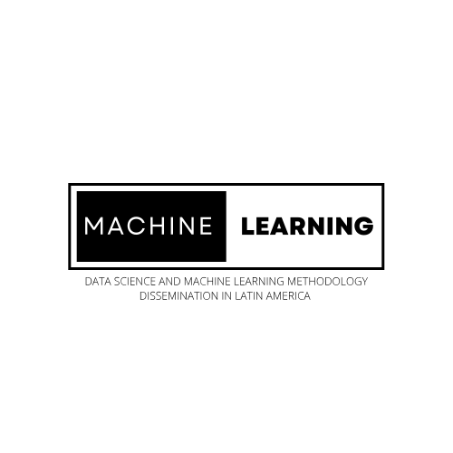

    

# An Initiative for Prevention Education and Research in Latin America

- Dr. Eric C. Brown
- Francisco Cardozo

University of Miami  
Miller School of Medicine  
Prevention Education and Research in Latin America Lab (PERLA) 

---

### Background

While the United States has seen substantial growth in the application of Machine Learning techniques in public health, Latin America presents an untapped opportunity for expansion. This project aims to capitalize on this potential by harmonizing and sharing Machine Learning methodologies in the region, thereby fostering scientific inclusivity and enhancing prevention science in Latin America.

---

### Objectives

1. To adapt Machine Learning methodologies to be culturally and linguistically appropriate for Latin American researchers.
2. To disseminate these methodologies through academic and research collaborations.

---

### Partners

- University of Los Andes
- Colombian Institute for Education and Evaluation (ICFES)
- Nuevos Rumbos Corporation

---

### Methods and Approach

The PERLA lab will deliver workshops and training sessions utilizing large-scale datasets provided by our collaborators. These datasets encompass health and educational risk and protective factors.

---

### Anticipated Impact

Funding from UM-IDSC will contribute to improving public health and education across the Americas, aligning with the University of Miami’s mission of fostering an inclusive academic community.

---

### Conclusion

By partnering with key institutions in Colombia, this project aims to reduce scientific inequity by empowering Latin American researchers with ML tools tailored to their specific cultural and linguistic needs.
